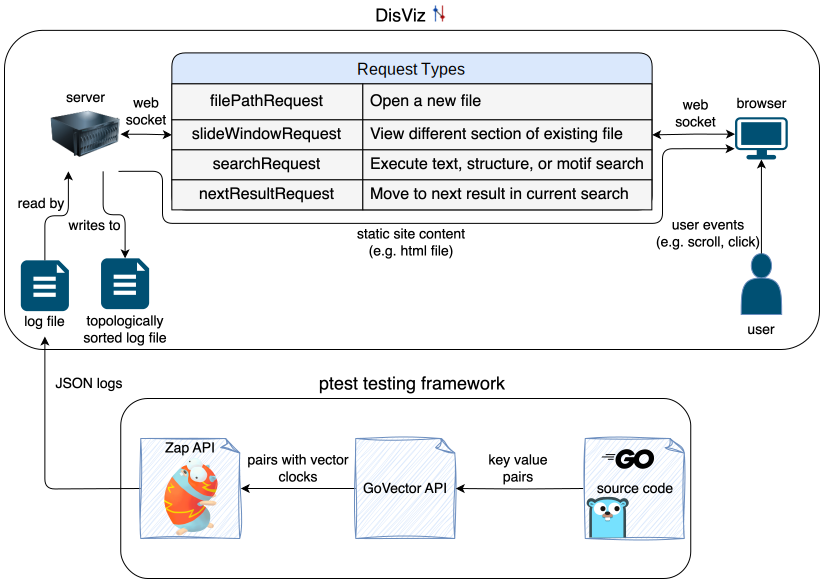

# meng_project

For my MEng, I made tools for debugging distributed system executions.

### DisViz

[DisViz](https://jmcmenamy.github.io/disviz/) is a browser-based tool to visualize distributed system logs. See the repo's README for more information on how to use it.

### GoVector

[GoVector](https://jmcmenamy.github.io/GoVector/) is a Go package for producing logs with vector clocks, which allows DisViz to parse them and create a visualization of the execution. See the repo's README for more information on how to use it.

### ptest

When debugging distributed systems, it's often necessary to run a test many times before getting a failure from a race condition, deadlock, etc. Go doesn't natively support running a test case many times in parallel (without specifically [implementing tests](https://pkg.go.dev/testing#T.Run) for this purpose), so having a tool to help run parallel tests can save a lot of time.

[ptest](https://github.com/jmcmenamy/meng_project/blob/main/parallel_tests/ptest) is a small bash script that uses a slightly modified python script called [dstest](https://gist.github.com/JJGO/0d73540ef7cc2f066cb535156b7cbdab). dstest is described in [this helpful article](https://blog.josejg.com/debugging-pretty/). ptest passes all arguments to dstest.

ptest looks for (or creates) a Python virtual environment (venv) and activates it to ensure dstest has the necessary Python dependencies available. It creates a timestamped directory and puts captured print output in a file in that directory. It also calls a binary from the GoVector package that wraps up all the log files from a test into one file that can be parsed by DisViz. When ptest runs a go test, it adds an `'output_dir'` command-line flag that user code can use to determine where to write log files, e.g. when initializing GoVector. See [here](https://pkg.go.dev/flag) for how to parse command-line flags.

Below is a diagram showing how all three of these tools are used together. It contains more detail than is needed to use the tools.

<picture>
  <source media="(prefers-color-scheme: dark)" srcset="thesis/diagram.drawioDark.svg">
  <source media="(prefers-color-scheme: light)" srcset="thesis/diagram.drawioLight.svg">
  
</picture>

### Installation and Usage

This repo contains 3 submodules that don't need to be cloned to use this tool. To clone just what is needed, you can use this command:

```bash
git clone git@github.com:jmcmenamy/meng_project.git && cd meng_project && git submodule update --init --recursive disviz GoVector
```

You only need to clone GoVector if you want to make local changes to that package (remember to use the replace directive in go.mod). Otherwise, letting Go install it from the [remote source](https://pkg.go.dev/github.com/jmcmenamy/GoVector) will work. See [GoVector](https://jmcmenamy.github.io/GoVector/) for more details.

Once the repo is cloned, you can run ptest with `bash path/to/ptest`, but for convenience you can also make it executable with `chmod +x path/to/ptest` and add it to your `PATH` so it can be called from anywhere. You can symlink the ptest script to a directory that's already in your `PATH`, or add the parallel_tests directory to your `PATH` in a config file like `~/.bashrc`. [Here's](https://jvns.ca/blog/2025/02/13/how-to-add-a-directory-to-your-path/) [some](https://medium.com/%40B-Treftz/macos-adding-a-directory-to-your-path-fe7f19edd2f7) [various](https://www.linode.com/docs/guides/how-to-add-directory-to-path/) resources describing how to modify your `PATH`.

### Motivation

When I took [6.5840](https://pdos.csail.mit.edu/6.824/), a large portion of my time was spent reading through print output from failed tests. It was difficult to piece together how the nodes in the system were communicating just by reading the logs, so I wanted to make something that would speed up the debugging process. [ShiViz](https://github.com/DistributedClocks/shiviz) was exactly the type of tool I wanted, but there were some pieces that prevented me from using it to debug my Raft implementation from 6.5840. So I focused my MEng on making changes to ShiViz and the author's logging library GoVector to enable me to debug my Raft implementation and generalize to working with larger systems like [etcd](https://github.com/etcd-io/etcd).

If you use DisViz in academic work, you can cite the following:

```bibtex
@misc{mcmenamy2025disviz,
  author = {Josiah McMenamy},
  title = {DisViz: Visualizing real-world distributed system logs with space time diagrams},
  year = {2025},
  howpublished = {\url{https://github.com/jmcmenamy/meng_project/blob/main/thesis/Josiah_MEng_Thesis.pdf}}
}
```